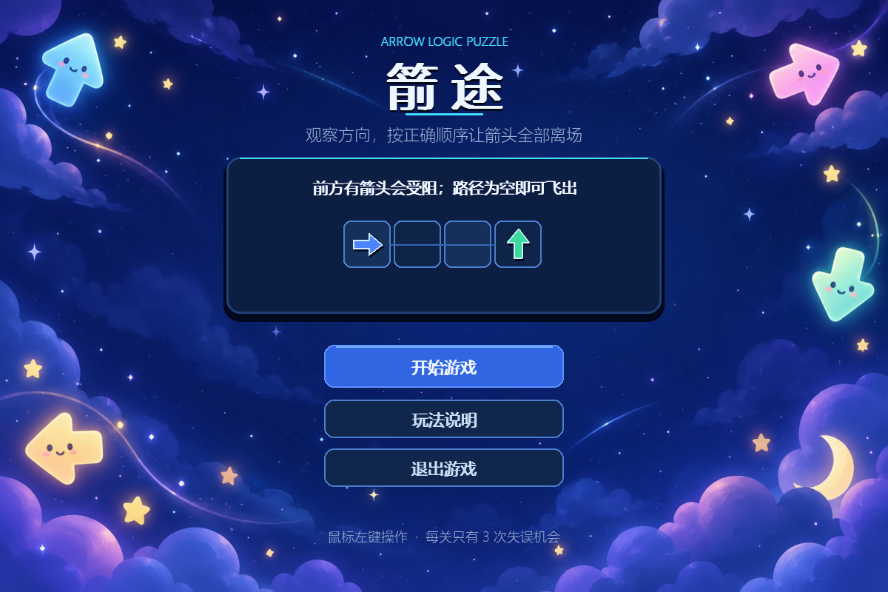
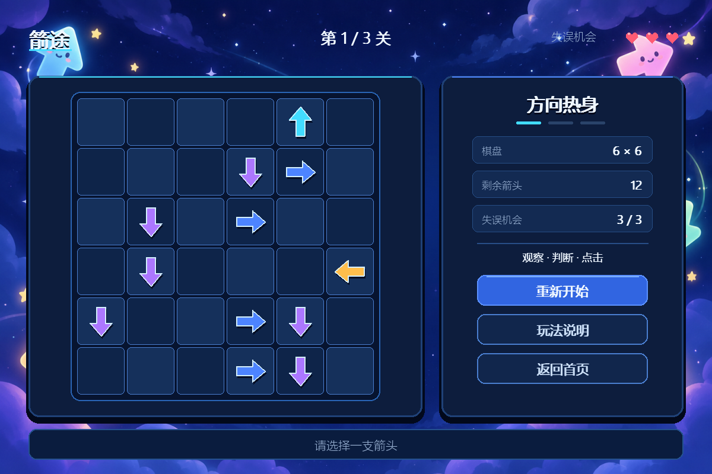
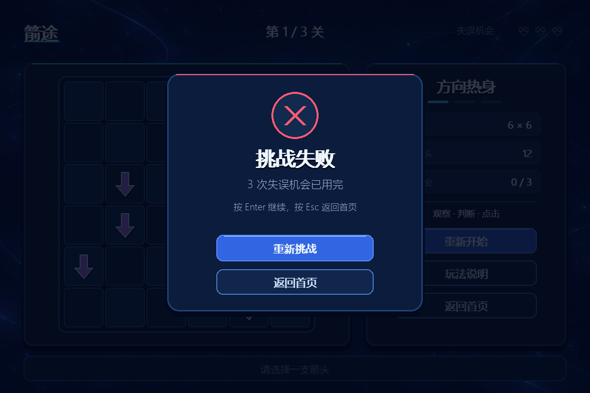
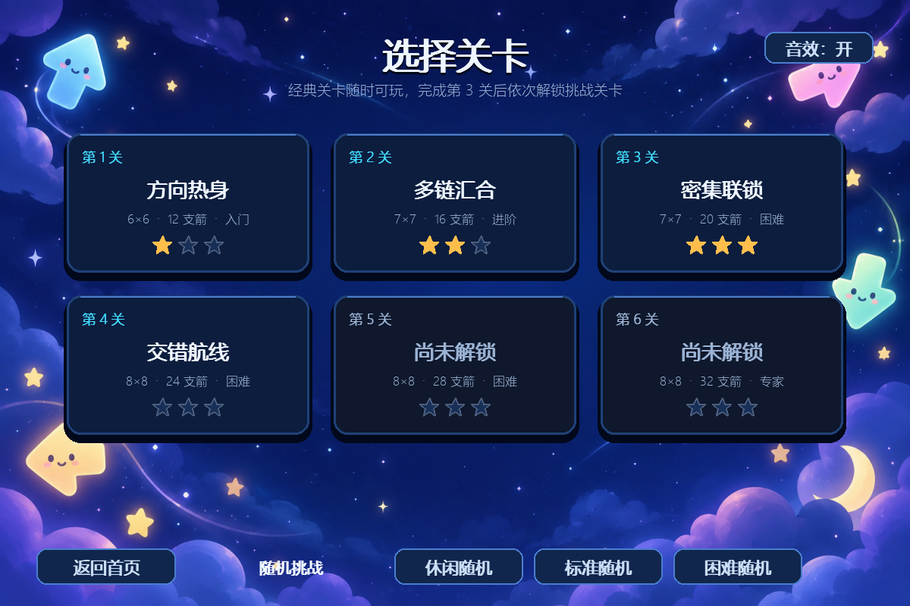
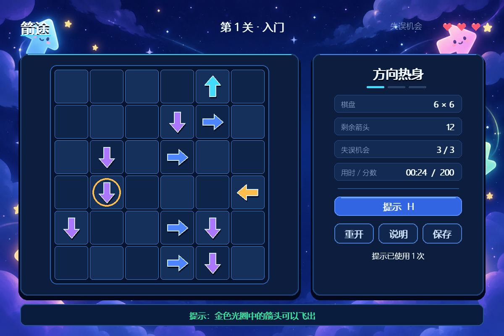
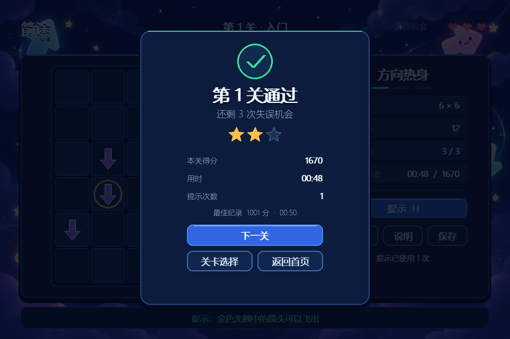

# 箭途（Arrow Escape）

使用 Python 与 Pygame 开发的“一箭又一箭”风格点击解谜游戏。玩家需要判断每支箭头正前方是否存在阻挡，并按合适顺序清空棋盘。

## 游戏功能

- 开始、游戏、关卡通过、失败和全部通关界面；
- 上、下、左、右四类箭头；
- 成功飞出和碰撞晃动动画；
- 每关固定 3 次失误机会；
- 6×6、7×7、7×7 三个递进关卡，共 12、16、20 支箭头；
- 3 个 8×8 挑战关卡，共 24、28、32 支箭头；
- 关卡选择、解锁状态和最佳星级；
- 计时、分数、1～3 星评价和最佳纪录；
- 安全箭头提示，提示与正常点击共用同一套阻挡规则；
- 休闲、标准、困难三档可复现的随机可解关卡；
- 当前残局保存与下次启动继续游戏；
- 粒子反馈和可关闭的程序合成音效；
- 重新开始、玩法说明和返回首页；
- 纯 Python 核心规则测试与关卡可解性验证。

## 游戏截图

### 开始界面



### 游戏界面



### 失败界面



### 扩展版关卡选择



### 扩展版游戏界面



### 分数与星级结算



## 开发环境

- Python 3.10 或更高版本
- Pygame 2.x

## 安装与运行

建议先创建虚拟环境，然后在项目根目录运行：

```powershell
python -m pip install -r requirements.txt
python main.py
```

## 操作方法

- 鼠标左键：点击箭头或按钮；
- `Enter`：开始游戏或确认结果界面的主操作；
- `Esc`：关闭玩法说明、返回首页或在首页退出；
- `H`：提示一支当前可以安全飞出的箭头；
- `R`：重新开始当前关卡；
- 点击空白格不会扣除失误机会；
- 点击受阻箭头会扣除 1 次失误，第三次失误后本关失败。

游戏页的“保存”会保存当前残局并返回首页；下次启动后可点击“继续游戏”。Windows 存档默认位于 `%LOCALAPPDATA%\ArrowEscape\progress.json`。

## 扩展版计分规则

```text
基础分   = 成功飞出的箭头数 × 100
失误奖励 = 通关时剩余失误机会 × 150
时间奖励 = max(0, 标准时间 - 实际秒数) × 10
提示扣分 = 提示次数 × 100
```

原三个经典关卡始终可选。完成第 3 关后解锁第 4 关，之后依次解锁第 5、6 关。随机挑战不写入固定关卡最佳纪录，但会在结果页显示种子，同一种子可复现相同布局。

## 运行测试

核心规则测试不依赖 Pygame：

```powershell
python -m unittest discover -s tests -v
```

## 构建 Windows 可执行文件

安装开发依赖后执行构建脚本：

```powershell
python -m pip install -r requirements-dev.txt
.\build.ps1
```

脚本会先运行全部测试，再使用 PyInstaller 生成 `dist\箭途.exe`。可执行文件不需要目标电脑安装 Python；图片资源会一并打包，用户进度仍保存在系统用户数据目录。

## 项目结构

```text
.
├─ main.py                 # 程序入口
├─ game/
│  ├─ app.py               # 主循环、界面绘制与交互
│  ├─ animation.py         # 飞出和碰撞动画
│  ├─ audio.py             # 可降级的程序合成音效
│  ├─ effects.py           # 粒子反馈
│  ├─ extra_levels.py      # 第 4～6 个固定挑战关卡
│  ├─ generator.py         # 可复现、保证可解的随机关卡
│  ├─ hints.py             # 安全箭头提示
│  ├─ levels.py            # 三个关卡数据与参考解法
│  ├─ models.py            # 数据模型和状态枚举
│  ├─ progress.py          # JSON 进度与最佳纪录
│  ├─ resources.py         # 源码/打包环境资源路径
│  ├─ rules.py             # 可独立测试的核心规则
│  ├─ scoring.py           # 得分、时间和星级计算
│  └─ ui.py                # 按钮、字体和图元绘制
├─ tests/                  # 规则与关卡测试
├─ assets/                 # 运行时背景与 Windows 图标
├─ docs/                   # 截图、策划与核对文档
│  ├─ 游戏策划.md         # 游戏策划与开发文档
│  └─ 游戏策划扩展.md     # 扩展功能策划与实施基线
├─ arrow_escape.spec       # PyInstaller 构建配置
├─ build.ps1               # 测试后打包脚本
├─ requirements.txt        # 运行依赖
└─ requirements-dev.txt    # 构建依赖
```

## 资源说明

棋盘、箭头、边框、按钮、爱心和点击反馈均通过 Pygame 图元实时绘制。全流程统一使用的可爱背景 `assets/start_background.png`、后备背景 `assets/ui_background.png` 和由开始背景裁切制作的 `assets/app.ico` 均为项目原创素材。游戏音效由程序运行时合成，没有使用商业游戏的代码、美术、音效或关卡素材。

背景生成提示词摘要：深蓝—靛青色抽象空间、柔和网格和方向轨迹、边缘装饰、中央低细节、无文字、无按钮、无角色、无水印，用于 1200×800 逻辑解谜游戏界面。

开始背景生成提示词摘要：梦幻深蓝夜空、薰衣草云朵、星光和飞行轨迹，四个圆润可爱的方向箭头吉祥物仅分布在外侧，中央低细节留给 UI，无文字、无按钮、无水印。
